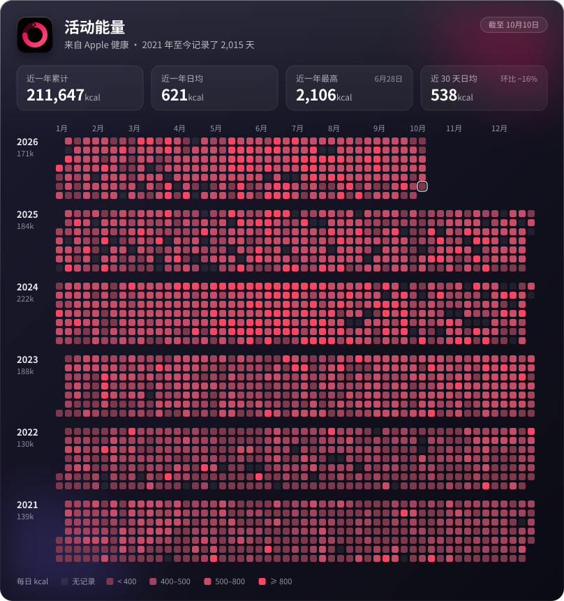

# activity-heatmap

把 Apple 健康里的「活动能量」画成热力图，挂在 GitHub 个人主页上。iOS 快捷指令触发 GitHub Action，数据存在这个仓库，图推到 [whrss9527/whrss9527](https://github.com/whrss9527/whrss9527) 的 `AppleHealthData.svg`。



从 [GitHubPoster](https://github.com/whrss9527/GitHubPoster) 里抽出来的，只留了 Apple 健康这一条链路。只用 Python 标准库，没有依赖要装，一次同步十几秒。

## 怎么工作

```
快捷指令 ── POST dispatches ──▶ .github/workflows/exercise_poster_generate.yml
                                 ├─ python3 -m heatmap sync    合并样本到 data/activity.json，重画 heatmap.svg
                                 ├─ 提交回本仓库
                                 └─ 复制到 whrss9527/whrss9527 的 AppleHealthData.svg
```

- 快捷指令传两个输入，和 GitHubPoster 完全一样：`time` 是每个样本的日期，`value` 是对应的千卡数，按顺序一一对应，用换行或逗号分隔。
- 同一天的样本相加，按 Asia/Shanghai 划分日子。这次收到的每一天会覆盖原来的值，也和原来一样。
- 每次运行在 Actions 的 job summary 里列出收到几个样本、每天原值 → 新值。某天比原来少了一成以上会标 ⚠️，一般说明快捷指令只发了那天的一部分数据。
- 两个输入对不上（比如 3 个日期、2 个数值）时这次运行会失败，不写入任何数据。

## 从 GitHubPoster 切换过来

1. 把这个仓库推到 GitHub，默认分支 `main`。
2. 仓库 Settings → Secrets and variables → Actions，添加 `WHRSS9527_ACCESS_TOKEN`：一个能推送 whrss9527/whrss9527 的 token，GitHubPoster 里用的那个就行。不加的话图只会更新在本仓库。
3. 改快捷指令里「获取 URL 内容」的地址，只换仓库名，请求体不用动：

   ```
   https://api.github.com/repos/whrss9527/activity-heatmap/actions/workflows/exercise_poster_generate.yml/dispatches
   ```

   地址里如果是一串数字（workflow id），换成上面的文件名。快捷指令用的如果是 fine-grained token，要把新仓库加进它能访问的仓库，并给 Actions 读写权限。
4. 在 Actions 页面对「Sync Apple Health」点 Run workflow，输入留空，确认主页上的图换成了新样式。
5. 切换期间旧仓库可能又收到过几次同步，用它的数据补一下，只补这里没有的日子：

   ```
   python3 -m heatmap import path/to/GitHubPoster/IN_FOLDER/apple_history.json
   ```

6. 都没问题后，GitHubPoster 可以归档了。

主页 README 不用改，文件名和位置都没变。想让它和上面的项目卡片对齐，可以换成居中写法：

```html
<p align="center"></p>
```

## 本地使用

```
python3 -m heatmap render                     # 只重画 heatmap.svg
python3 -m heatmap sync --time "2026-09-29T08:00:00+08:00" --value "120"
python3 -m unittest                           # 跑测试
```

参数：`--years 3` 只画最近三年；`--levels 400,500,800` 固定分档，默认按全部历史取 25%、50%、90% 分位；`--title` 改标题；`--tz` 改时区。要在线上生效，就加到 workflow 里 `python3 -m heatmap sync` 那一行。

## 文件

| 文件 | 作用 |
| --- | --- |
| `heatmap/ingest.py` | 解析快捷指令发来的数据，合并进历史 |
| `heatmap/render.py` | 画 SVG 卡片 |
| `data/activity.json` | 每天一行，`git log -p data/activity.json` 能看到每次同步改了哪几天 |
| `heatmap.svg` | 最新的图 |
